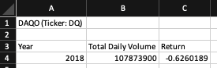
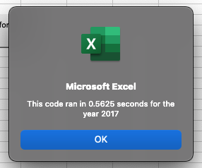
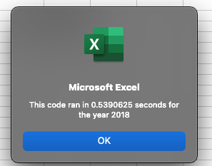

# Stock Analysis

## Overview of Project

This was an analysis of predetermined "green" companies stock performance.

### Purpose

    The purpose of this stock analysis was to determine how to diversify a portfolio of stocks for "green" companies. We wanted to determine the growth patterns of stock of the current investment as well as determine other viable options for future investment and diversification. We took twelve companies that were within the "green" sector of the market and analyzed their stock performance over the years of 2017 and 2018 to determine their growth and potential for investment.

## Results

### Analysis of Current Investment Daqo "DQ"

    Currently, the portfolio being examined only has investments in the company Daqo, so initially we wanted to analyze the performance of their stock pver the most recent year available to us, 2018. This was done by writing a subroutine in VBA that would determine the total volume of sales of the stocks over a year, and the starting and ending prices for the year. The total volume of sales would allow us to determine if the sale prices were an accurate representation of the market value of the stocks. Determining the start and end prices would allow us to evaluate the performance of the stock over the year. This was accomplished by creating a loop that would combine the total volume of sales for all the data points associated with the "DQ" ticker while also determining the first sale of the year and the last sale of the year.

```
        For i = rowStart To rowEnd
    
            'increase totalVolume by the value in the current row
            If Cells(i, 1).Value = "DQ" Then
        
                totalVolume = totalVolume + Cells(i, 8).Value
        
            End If
        
            'Sets startingPrice
            If Cells(i, 1).Value = "DQ" And Cells(i - 1, 1).Value <> "DQ" Then
            
                startingPrice = Cells(i, 6).Value
            
            End If
        
            'Sets endingPrice
            If Cells(i, 1).Value = "DQ" And Cells(i + 1, 1).Value <> "DQ" Then
            
                endingPrice = Cells(i, 6).Value
            
            End If
        
        
        Next i
```

    Once the information was collected from the `For` loop we were able to display it on a separate worksheet we created to analyze the data. Below is what the code returned:



    It was clear that the performance of the stocks that Steve and his family were invested in had negative returns.

### Initial Analysis of multiple "green" stocks from 2017 and 2018

    After determining that the current investment was not performing well, analysis of other potential investments was necessary. Steve had predetermined 11 other potential stock investments that fit his parameters for "green" stock. I initially created a similar loop with an array of the 12 tickers for the stocks. Using the array, I was able to collected the same information by using a similar loop, but adding new variables to collect data on. The array can be seen below.

```
    Dim tickers(12) As String
    tickers(0) = "AY"
    tickers(1) = "CSIQ"
    tickers(2) = "DQ"
    tickers(3) = "ENPH"
    tickers(4) = "FSLR"
    tickers(5) = "HASI"
    tickers(6) = "JKS"
    tickers(7) = "RUN"
    tickers(8) = "SEDG"
    tickers(9) = "SPWR"
    tickers(10) = "TERP"
    tickers(11) = "VSLR"
```

    I also created an input box to determine the year for which the subroutine analysis could be chosen. This was done by creating a variable that would be selected by `InputBox` using the line

```
 yearValue = InputBox("What year would you like to run the analysis on?")
```

    This allowed the year being analyzed to be chosen everytime the subroutine was run.

### Formatting and Refactoring for Speed and Clarity

    The analysis in it's current form was difficult to read. So I endeavored to add some formatting, while also trying to reduce the amount of time the program took to run. I started by entering a new formatting subroutine to format the data that had already been run through my previous analysis, you can see it below:

```
Sub formatAllStocksAnalysis()
    
    'Formatting
    Worksheets("All Stocks Analysis").Activate
    Range("A3:C3").Font.Bold = True
    Range("A3:C3").Borders(xlEdgeBottom).LineStyle = xlContinuous
    Range("B4:B15").NumberFormat = "#,##0"
    Range("C2:C15").NumberFormat = "0.0%"
    Columns("B").AutoFit
    
    dataRowStart = 4
    dataRowEnd = 15
    For i = dataRowStart To dataRowEnd
        
        If Cells(i, 3).Value > 0 Then
        
            'Color cell green
            Cells(i, 3).Interior.Color = vbGreen
            
        ElseIf Cells(i, 3).Value < 0 Then
        
            'Color cell red
            Cells(i, 3).Interior.Color = vbRed
        
        Else
            
            'Clear cell color
            Cells(i, 3).Interior.Color = xlNone
            
        End If
    Next i

End Sub
```

    This formatting would make it clearer to see which stocks had performed well, and which had not by coloring them red or green based on their negative or positive performnce, respectivley over the year the analysis was done. Once I had completed this subbroutine I wanted to try and create a single subroutine that could include both this new formatting and a quicker Index based nested loop to bring up the speed of the program by reducing the number of loops needing to be proccessed. In this new refactoed subroutine I created 3 new arrays and an Index to refrence them from. This would mean the program would only need to loop through all the rows for the respective ticker once. I also added a timer to analyze the speed of the programs. Below you can see the images for speed regarding both the 2017 and 2018 analysis.





    It was clear that the program ran through the information fast, but the added benefit of including the formatting of the returned information just added to the benefit of refactoring.

## Summary

### Refactoring Advantages and Disadvantages

    In general, refactoring code can be time consming and lead to frustration and delays when the code that already exists is doing it's job. In this case, due to the smaller amount of data being analyzed, refactoring would not have provided much benefit, other than to merge subroutines that were separated. The original code I wrote was doing the job very quickly already and accomplishing the goal. However, the larger the dataset the more important reducing the processing time is.